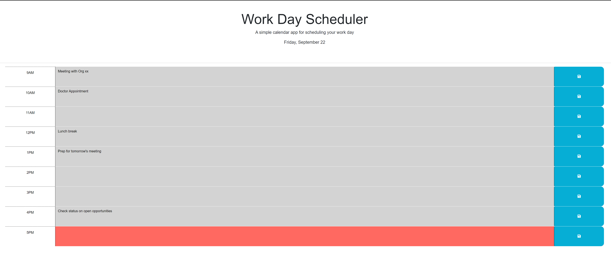
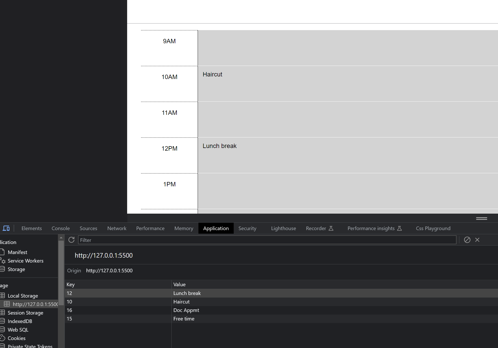

# Work Day Scheduler Starter Code
A repository to hold the source code to my Work Day Scheduler application. My deployed application may be viewed through the section titled ## Deployed application link. 

## Motivation
This project exists to showcase my ability to utilize frameworks like Dayjs, Bootstrap, Jquery, html, and CSS to create a dynamic calendar application that stores and persists data provided by text inputs.

## Screenshots

Below are screenshot examples of the application, and it's functionality:

## Tech/framework used

Dayjs, Bootstrap, JQuery, HTML,  CSS, and Google Fonts

## Deployed application link

Deplyed application: https://nicanthoni.github.io/project-work-day-scheduler/

## How to use?
Open the deployed application to begin. Date in header is a live date, set to update every minute.Business hour (9-5) time slots in the 'past' grey, times in the 'present' are red, and times in the 'future' are green. Type into the text area, and click the save icon within the same row to save that data to local storage. Regresh the page to watch the data persist. To alter any saved text, simply click into the row and delete/alter it, and save again to save those changes.

## License

MIT © [nicanthoni]()